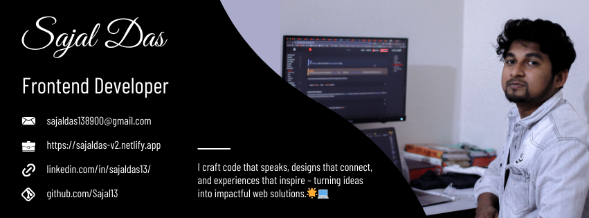

# 👋 Hi, I'm Sajal Das!  

## 🚀 Front-End Developer | React & Next.js Enthusiast | JavaScript Ninja  
I'm a passionate **Front-End Developer** with a knack for creating intuitive, high-performing web applications. With a strong foundation in **React, Next.js, and Node.js**, I enjoy turning complex challenges into elegant, scalable solutions.

---

### 💡 About Me  

- 🔭 Currently working on **modernizing web interfaces** and **building full-stack applications**.  
- 🌱 Learning: **Three.js** to dive into the world of 3D animation and **NestJs** for beautiful backend.  
- 💼 Experienced in building top-ranking templates like **Phoenix** and **Falcon** for the Bootstrap marketplace.  
- ✨ Fun Fact: My journey started with coding competitions and Figma-to-code transformations!  

---

### 🛠️ Skills & Tools  

#### Front-End  

  
  
  
  
  
  
  
  

#### Back-End  

  
  
  

#### Tools  

  
  
  
  
  

#### Libraries & Frameworks  

  
  

#### Templates & Preprocessors  

  

---

### 📊 GitHub Stats  

  
  

---

### 🌐 Connect with Me 

  
  
  

  

---

> _"The best way to predict the future is to invent it."_  
Keep coding, keep creating! 🚀
