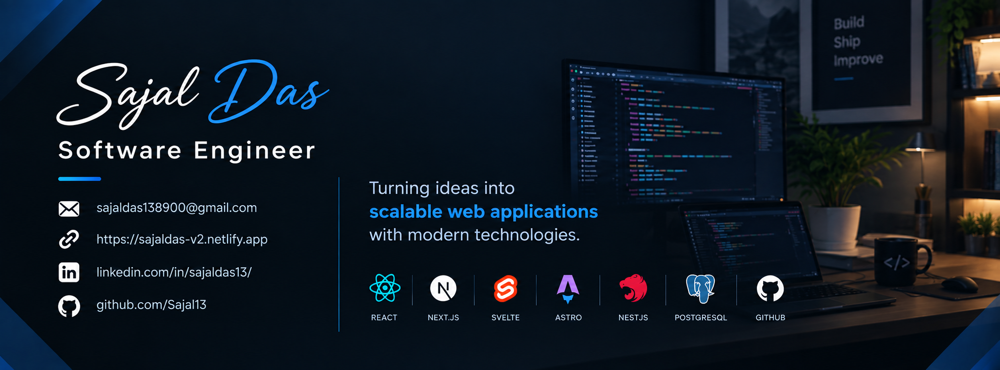

<div align="center">



# 👋 Hi, I'm **Sajal Das**

### Software Engineer · Frontend Specialist · React & Next.js

<a href="https://sajaldas-v2.netlify.app/">
  
</a>
<a href="https://www.linkedin.com/in/sajaldas13/">
  
</a>
<a href="mailto:sajaldas138900@gmail.com">
  
</a>

<br />
<br />


<br />

</div>

---

## 🧑‍💻 About Me

I'm a **Software Engineer with 3.5+ years of experience** building production-ready web applications.

My primary focus is **frontend engineering**, with experience across:

- React & Next.js
- TypeScript & JavaScript
- Scalable component architecture
- API-driven applications
- Performance optimization
- Responsive interfaces
- Modern UI development
- Production application development

Currently at **Rockstreamer**, I'm working on an **OTT platform and custom CMS**, building video-streaming experiences and modernizing existing production systems with **React, Next.js, Tailwind CSS, and Video.js**.

I enjoy taking an idea from:

**Design → Architecture → Implementation → Optimization → Production**

---

## ⚡ What I Work On

```text
┌──────────────────────────────────────────────────────────────┐
│                                                              │
│  🧩 Frontend Architecture                                    │
│     Scalable · Reusable · Maintainable                       │
│                                                              │
│  🚀 Modern Web Applications                                  │
│     React · Next.js · TypeScript                             │
│                                                              │
│  🎬 OTT & Video Experiences                                  │
│     Video.js · Adaptive Streaming · CMS                      │
│                                                              │
│  ⚙️ Performance Engineering                                  │
│     Code Splitting · Lazy Loading · Optimization              │
│                                                              │
│  🔌 API-driven Applications                                  │
│     REST APIs · Authentication · Dynamic Content              │
│                                                              │
└──────────────────────────────────────────────────────────────┘
```

---

## 🧰 Technology Stack

### Frontend
<p align="left">
  
</p>

### Styling & UI
<p align="left">
  
</p>

### Backend & Database
<p align="left">
  
</p>

### Tools & Workflow
<p align="left">
  
</p>

### Libraries & Platforms
<p align="left">
  Redux Toolkit · TanStack Table · Video.js · Swiper.js · ECharts · Leaflet · Framer Motion
</p>

---

## 🚀 Things I've Built

<table>
<tr>
<td width="50%" valign="top">

### 🎬 OTT Platform & CMS
**Rockstreamer**

A production OTT ecosystem consisting of a modern CMS and video streaming platform.

**Built with**
React · Next.js · Tailwind CSS · Video.js

**Focus**
- CMS-driven content
- Video playback
- Adaptive streaming
- Reusable architecture
- Legacy modernization

</td>
<td width="50%" valign="top">

### 🏛️ Government & Client Applications
**Next.js Applications**

Built and deployed full-scale applications including:
- BMTF
- BMTF Ecommerce
- Algo-Kids

**Focus**
- API integration
- Dynamic routing
- Reusable components
- Responsive UI
- Performance
- SEO

</td>
</tr>
<tr>
<td width="50%" valign="top">

### ⚛️ Commercial React Applications
**Phoenix · Falcon · Aurora**

Production React-based admin and UI templates developed for marketplace distribution.

**Focus**
- Component systems
- Scalable layouts
- Bootstrap
- Material UI
- Customization
- Reusability

</td>
<td width="50%" valign="top">

### 🧩 Multi-framework Applications
**Svelte · Astro · Vue**

Worked across applications including:
- TRMIs
- Nokshasemi
- IPics

Also implemented an audio-to-text transcription feature in IPics.

</td>
</tr>
</table>

---

## 🧠 Currently Exploring

<table>
<tr><td>🟣 <strong>NestJS</strong></td><td>Backend architecture & APIs</td></tr>
<tr><td>🗄️ <strong>PostgreSQL</strong></td><td>Relational data & scalable backend systems</td></tr>
<tr><td>🔷 <strong>Three.js</strong></td><td>Interactive 3D web experiences</td></tr>
<tr><td>🟢 <strong>React Three Fiber</strong></td><td>3D experiences with React</td></tr>
<tr><td>⚡ <strong>GSAP</strong></td><td>Advanced web animation</td></tr>
<tr><td>📡 <strong>Offline-first Web</strong></td><td>Caching & resilient web applications</td></tr>
</table>

---

## 💡 Engineering Philosophy

> Build it clean. Make it fast. Keep it maintainable.

I care about more than making an interface look good. My focus is:

- **Architecture** — Reusable systems instead of duplicated code.
- **Performance** — Fast experiences without unnecessary complexity.
- **Maintainability** — Code that other developers can understand and extend.
- **User Experience** — Interfaces that feel natural and intuitive.
- **Continuous Learning** — Improving the engineering process with every project.

---

## 🎓 Education

**Bachelor of Technology — Computer Science & Engineering**
<br />
Maharishi Markandeshwar (Deemed to be) University, India
(2018 — 2022)

---

## 📊 GitHub Activity

<div align="center">
<picture>
  <source media="(prefers-color-scheme: dark)" srcset="https://raw.githubusercontent.com/Sajal13/Sajal13/output/github-contribution-grid-snake-dark.svg" />
  <source media="(prefers-color-scheme: light)" srcset="https://raw.githubusercontent.com/Sajal13/Sajal13/output/github-contribution-grid-snake.svg" />
  
</picture>
</div>

<br />

<div align="center">
  
</div>

---

## 📫 Let's Connect

<div align="center">

<a href="https://sajaldas-v2.netlify.app/">
  
</a>
<a href="https://www.linkedin.com/in/sajaldas13/">
  
</a>
<a href="mailto:sajaldas138900@gmail.com">
  
</a>

<br /><br />

**Building today. Learning tomorrow. Improving every commit. 🚀**

</div>